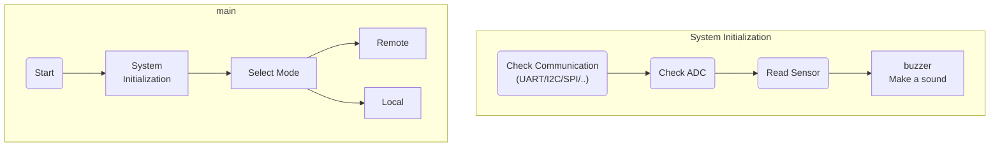

# µPower Module

1. Purpose：

 - DC/DC Programmable small-wattage power supply
 - This project is [Open Source Hardware](https://www.oshwa.org/definition/chinese/)

2. Scope：
 - RFQ
     1. MCU auto-regulator function
     2. Real time display of voltage and current
     3. Support [MikroBus](https://www.mikroe.com/mikrobus) Foot Position
     4. Expansion of the MAX6675 Module K-Type Thermocouple Temperature Sensor using the SPI interface in the Mikrobus hardware interface Thermocouple Sensor
     5. PCB size and pinout support for [Arduino UNO](https://docs.arduino.cc/hardware/make-your-uno-kit)
     6. Display voltage/current/wattage [Nokia 5110 LCD](https://github.com/EleonoreMizo/pedalevite/blob/master/doc/datasheets/Philips%20PCD8544%20-%20IC%2C%2048x84%20pixels%20matrix%20LCD%20controller%20(Nokia%205110).pdf), [TI-Nokia 5110 LCD](https://www.ti.com/lit/ml/swrp182/swrp182.pdf), [Nokia5110 LCD ](https://components101.com/displays/nokia-5110-lcd)
     7. Use a led to display local or remote mode
     8. Compatible [OpenLog](https://github.com/sparkfun/OpenLog) Module
     9. Over voltage protection circuit

# HW Block Diagram

 
plug-in module. ex. Temperature sensor, etc..  

# SW FlowChart

# Cost

|item|Category|Manufacturer|Product Number|Price   (Mouser / Digikey) | Decision |
|----|--------|------------|--------------|--------|------|
|1|Microcontrollers| Respberry Pi | RP2040 | [NT\$34.20 ](https://mou.sr/45vLjef) / [NT$25.00](https://www.digikey.tw/short/p5ffv21r)| Yes |
|2|RS485 Transceivers| MaxLinear, Inc.|SP485EN-L/TR|[NT\$32.15](https://mou.sr/42Rj2wX) / [NT\$34.00](https://www.digikey.tw/short/hb5m5z30) | Yes |
|3|Current Sensor|Texas Instruments |INA219|[NT\$89.61](https://mou.sr/45781sN) / [NT$93.00](https://www.digikey.tw/short/9j14fp42)| Yes |
|4|System Voltage Regulators|Monolithic Power Systems (MPS)|MP2315|[NT\$71.48](https://mou.sr/45hrnM1) / [NT$98.00](https://www.digikey.tw/short/2qjpbj48)| Tentative |
|5|Digital Potentiometers|Microchip Technology|MCP4019T|[NT\$24.97](https://mou.sr/3HOJMpd) / [NT\$25.00](https://www.digikey.tw/short/0jqd2wv8)| Tentative |

# Candidate Components

The required hardware units are divided into the following 6 items.
1. Power
2. Microcontroller
3. Interface
4. Sensor (Current/temperature)
5. Connector
6. Debug port

## Voltage Regulators

### LDO
1. ADJ [MIC5205](https://mou.sr/3IsLs8f) Output Current: 150mA, Maximum Input Voltage: 16V NT\$19.84
2. 3.3V [L78L33ACUTR](https://mou.sr/3NOMRcP) Output Current: 100mA, Maximum Input Voltage: 30V NT\$21.21 
3. 5V [MIC5219-5.0YM5-TR](https://mou.sr/3HTMLwK) Output Current: 500mA, Maximum Input Voltage: 12V NT\$43.10
4. 5V [R1172N501D-TR-FE](https://mou.sr/3HPtoog) Output Current: 1A, Maximum Input Voltage: 6V  NT\$41.73 	

### Buck - Switching Voltage Regulators
1. [MP2315SGJ-P ](https://mou.sr/3M9TaXc)
    > 1. [Mini low voltage module qs-1205cme-3a](https://dientu360.com/module-ha-ap-mini-qs-1205cme-3a)
    > 2. [【造物人】《可統編》1205CME-3A mini 超小體積 DC-DC可調降壓模組 效率97.5% 3A輸出 車載](https://shp.ee/5mihzr4)
    >   
    > **QS-1205CME-3A SPECIFICATIONS**
    > - Using IC: MP2315GJ-Z TSOT23-8
    > - Input voltage: DC 4.5-24V
    > - Adjustable range (0.8-17V), fixed voltage (1.8V 2.5V 3.3V 5V 9V 12V)
    > - Efficiency: 97.5% at voltage 5 - 6.5V / 0.7A, 94% at voltage 5 - 12V / 1A.
    > - Switching frequency: 1MHz (normal), 1.5Mhz (max)
    > - Output current: 3A (peak value), 2.1A (long time)
    > - Output ripple: < 30mV
    > - Dimensions: 20x11x5mm
    > - Weight: 2g 

### Boost
1. [MT3608](https://www.olimex.com/Products/Breadboarding/BB-PWR-3608/resources/MT3608.pdf)

## ARM MCU 

1. [Raspberry Pi RP2040](https://mou.sr/45vLjef) NT\$34.20 

## [Provisional] Digital Potentiometer ICs 
> Perhaps DAC ICs can be used instead of Digital Potentiometer ICs 
1. [MCP4019T](https://mou.sr/3HOJMpd)  NT$24.97 
2. [MCP4725](https://mou.sr/3IfzNtm) NT$46.17

# Reference

## Protocols Reference 
1. [Chroma](https://www.chromaate.com/en/index) 
   
2. [Kikusui](https://global.kikusui.co.jp/products-index/dc/) 

3. [GWinsTek](https://www.gwinstek.com/en-global) 

# License & Disclaimer

   This work is licensed under a <a rel="license" href="https://creativecommons.org/licenses/by-sa/4.0/">Creative Commons Attribution-ShareAlike 4.0 International License</a>.

If you have other ideas or suggestions, please feel free to submit an issue.
Welcome fork this repositories to provide contributions, or [buy me a coffee](https://ko-fi.com/yingchao_tw). thanks :)