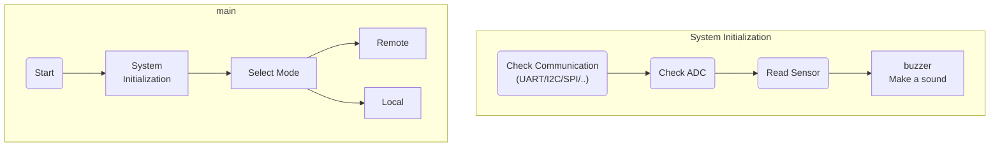

# µPower Module

1. Purpose：

 - DC/DC Programmable small-wattage power supply
 - This project is [Open Source Hardware](https://www.oshwa.org/definition/chinese/)

2. Scope：
 - RFQ
     1. [x] Over voltage protection circuit
     2. [x] Support [MikroBus](https://www.mikroe.com/mikrobus) Foot Position
     3. [ ] Positive and negative load voltage signals can be controlled by the H-bridge
     4. [ ] MCU auto-regulator function
     5. [ ] Real time display of voltage and current
     6. [ ] Expansion of the MAX6675 Module K-Type Thermocouple Temperature Sensor using the SPI interface in the Mikrobus hardware interface Thermocouple Sensor
     7. [ ] PCB size and pinout support for [Arduino UNO](https://docs.arduino.cc/hardware/make-your-uno-kit)
     8. [ ] Display voltage/current/wattage [Nokia 5110 LCD](https://github.com/EleonoreMizo/pedalevite/blob/master/doc/datasheets/Philips%20PCD8544%20-%20IC%2C%2048x84%20pixels%20matrix%20LCD%20controller%20(Nokia%205110).pdf), [TI-Nokia 5110 LCD](https://www.ti.com/lit/ml/swrp182/swrp182.pdf), [Nokia5110 LCD ](https://components101.com/displays/nokia-5110-lcd)
     9.  [ ] Use a led to display local or remote mode

# HW Block Diagram

 
plug-in module. ex. Temperature sensor, etc..  

[Schematic Readme](./Circuit_microPowerModule/Readme.md)

# SW FlowChart

# Candidate Components

The required hardware units are divided into the following 6 items.
1. Power
2. Microcontroller
3. Interface
4. Sensor (Current/temperature)
5. Connector
6. Debug port

# PIN Assessment

Raspberry Pi RP2040 pin assessment

0. UART0 (Tx) -> RS485 (In)
1. UART0 (Rx) -> RS485 (Out)
2. I2C1 (SDA)
3. I2C1 (SCL)
4. I2C0 (SDA)
5. I2C0 (SCL)
6. DS (MOSI)
7. DS (CLK)
8. UART1 (Tx)
9. UART1 (Rx)
10. SPI1 (SCK)
11. SPI1 (Tx)
12. SPI1 (Rx)
13. SPI1 (nCS)
14. DS (CE)
15. DS (DC)
16. PWM0_A
17. MikroBus_RST
18. PWM1_A
19. PIO1_IRQ1
20. PWM2_A
21. PWM2_B
22. RS_485 W/R
23. DS_RST
24. ENC_SW
25. LED_CTRL
26. Power_Monitor
27. ADC1
28. Output_CTRL
29. (Reserve)

# Potocol

[About Spec](./Document/Specification/Spec_link.md)
[Standard Commands for Programmable Instruments](https://www.ivifoundation.org/docs/scpi-99.pdf)

# Licenses & Disclaimer

   This work is licensed under a <a rel="license" href="https://www.gnu.org/licenses/quick-guide-gplv3.en.html"> GNU General Public License v3</a>.

If you have other ideas or suggestions, please feel free to submit an issue.
Welcome fork this repositories to provide contributions, or [buy me a coffee](https://ko-fi.com/yingchao_tw). thanks :)