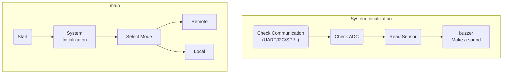

[](https://github.com/tw1chao/micro_PowerModule)
[](https://www.gnu.org/licenses/quick-guide-gplv3.en.html)
[](https://github.com/tw1chao/micro_PowerModule/fork)
[](https://github.com/tw1chao/micro_PowerModule/stargazers)
[](https://ko-fi.com/yingchao_tw)
[](https://paypal.me/tw1chao)


# µPower Module

1. Purpose：

 - DC/DC Programmable small-wattage power supply
 - This project is [Open Source Hardware](https://www.oshwa.org/definition/chinese/)


2. Scope：
 - RFQ
     1. [x] Over voltage protection circuit
     2. [x] Support [MikroBus](https://www.mikroe.com/mikrobus) Foot Position
     3. [x] Positive and negative load voltage signals can be controlled by the H-bridge
     4. [x] Display voltage/current/wattage [Nokia 5110 LCD](https://github.com/EleonoreMizo/pedalevite/blob/master/doc/datasheets/Philips%20PCD8544%20-%20IC%2C%2048x84%20pixels%20matrix%20LCD%20controller%20(Nokia%205110).pdf), [TI-Nokia 5110 LCD](https://www.ti.com/lit/ml/swrp182/swrp182.pdf), [Nokia5110 LCD ](https://components101.com/displays/nokia-5110-lcd)
     5. [ ] MCU auto-regulator function
     6. [ ] Real time display of voltage and current
     7. [ ] Use a led to display local or remote mode
        1. [x] Standard Commands for Programmable Instruments

# HW Block Diagram

<a href="https://app.diagrams.net/#Htw1chao%2Fmicro_PowerModule%2Fmain%2FDocument%2FHardware%20Block%20Diagram%2F%C2%B5PowerModule.drawio">  </a>
<BR/>
plug-in module. ex. Temperature sensor, etc.. <br/>

[Schematic Readme](./Circuit_microPowerModule/Readme.md)

# SW FlowChart


# Candidate Components

The required hardware units are divided into the following 6 items.
1. Power
2. Microcontroller
3. Interface
4. Sensor (Current/temperature)
5. Connector
6. Debug port

# PIN Assessment

[Raspberry Pi RP2040 GPIO Function](https://datasheets.raspberrypi.com/rp2040/rp2040-datasheet.pdf#_gpio_functions)


```
GPIO00 UART0 (Tx) --> RS485 (In)
GPIO01 UART0 (Rx) <-- RS485 (Out)
GPIO02 I2C1 (SDA) <-> (*Option) MikroBus SDA
GPIO03 I2C1 (SCL) --> (*Option) MikroBus SCL
GPIO04 I2C0 (SDA) <-> Power Management
GPIO05 I2C0 (SCL) --> Power Management
GPIO06 DS (MOSI)  --> Display Serial Input
GPIO07 DS (CLK)   --> Display Clock Input
GPIO08 UART1 (Tx) --> (*Option) MikroBus Tx
GPIO09 UART1 (Rx) <-- (*Option) MikroBus Rx
GPIO10 SPI1 (SCK) --> (*Option) MikroBus SCK
GPIO11 SPI1 (Tx)  --> (*Option) MikroBus SDI
GPIO12 SPI1 (Rx)  <-- (*Option) MikroBus SDO
GPIO13 SPI1 (nCS) --> (*Option) MikroBus CSS
GPIO14 DS (CE)    --> Display Chip Enable
GPIO15 DS (DC)    --> Display Data Command
GPIO16 PWM0_A     --> Buzzer
GPIO17 MkBus_RST  --> (*Option) MikroBus Reset
GPIO18 PWM1_A     --> (*Option) MikroBus PWM
GPIO19 PIO1_IRQ1  --> (*Option) MikroBus INT
GPIO20 PWM2_A     --> Encoder A phase
GPIO21 PWM2_B     --> Encoder B phase
GPIO22 RS_485 W/R --> RS485 (W/R)
GPIO23 DS_RST     --> Display Reset
GPIO24 ENC_SW     <-- Encoder Push Switch
GPIO25 PWM4 B     --> WS2512 LED Control
GPIO26 Monitor    <-- Input Power Monitor
GPIO27 ADC1       <-- (*Option) MikroBus ADC
GPIO28 Output_CTRL<-- Buck / Boost Switch
GPIO29 *Polarity  --> H-Bridge Control Load (Forward/Reverse)
```


# Potocol

[About Spec](./Document/Specification/Spec_link.md)
[Standard Commands for Programmable Instruments](https://www.ivifoundation.org/docs/scpi-99.pdf)

# Licenses & Disclaimer

<a rel="license" href="https://www.gnu.org/licenses/quick-guide-gplv3.en.html"></a> <br/> This work is licensed under a <a rel="license" href="https://www.gnu.org/licenses/quick-guide-gplv3.en.html"> GNU General Public License v3</a>.

If you have other ideas or suggestions, please feel free to submit an issue.
Welcome fork this repositories to provide contributions, or [buy me a coffee](https://ko-fi.com/yingchao_tw). thanks :)